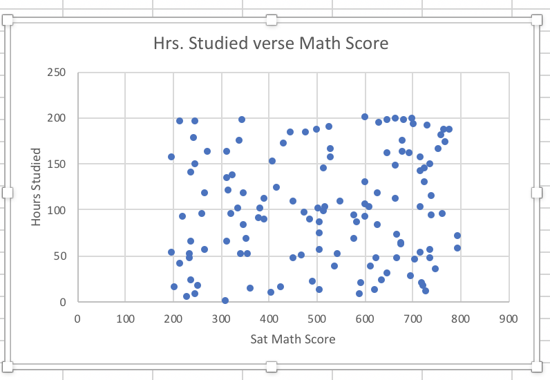
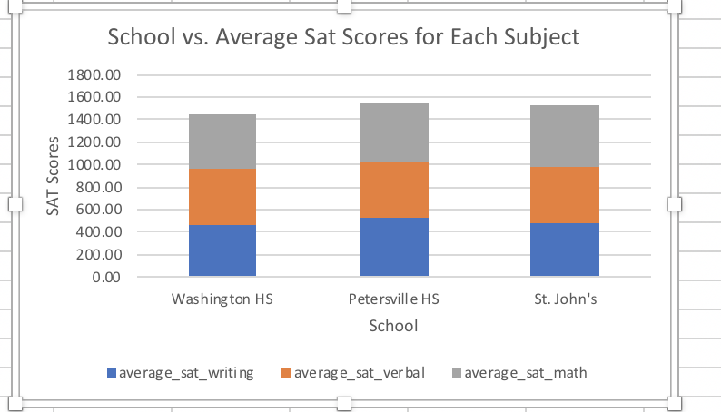
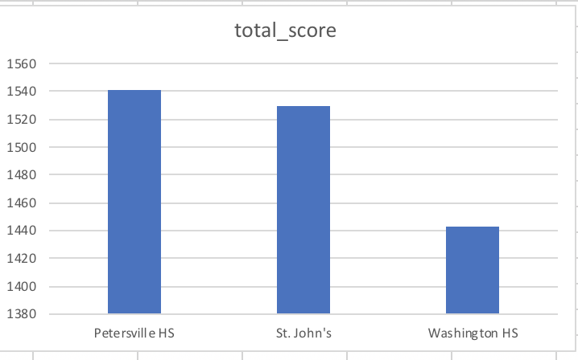
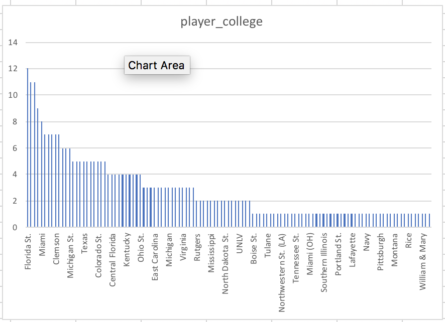
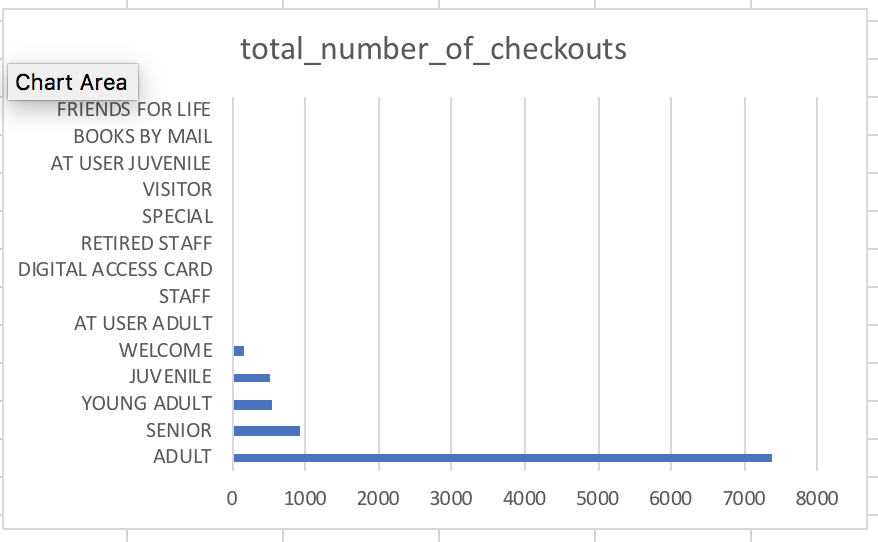

## ICA #4
SQL to Business Insights

## Description
3 questions under the dataset.sat_scores table which includes teachers, schools, hours studied, and test scores for sat writing, verbal, and math. 

## Question 1
How does hours studied affect the math score? 

```sql
Select sat_math, hrs_studied
from datasets.sat_scores
where hrs_studied notnull 
order by hrs_studied ASC 
```


## Question 2 
What was the average SAT math, writing, and verbal? Order by school.

```sql
Select school, avg(sat_writing) as avg_writing, avg(sat_math) as avg_math, avg(sat_verbal) as avg_verbal
from datasets.sat_scores
group by school
```



## Question 3 
What was the average total score for each school? 

```sql
Select school, avg(sat_writing + sat_verbal + sat_math) as total_score
from datasets.sat_scores
group by school
order by total_score DESC
```



## Desription 
The datasets table nfl_combine includes data on nfl combine participants, their statistics from the combine, the college they attended, and their round pick. 

## Question 4
Which schools had the most players in the nfl_combine in 2015? 

```sql
Select college, count(college) as player_college
from datasets.nfl_combine
where year = '2015'
group by college
order by player_college DESC
```


## Description
The data from datasets.library_usage contains information from checkouts and renewals, to the type of person checking out the book and where. 

## Question 5
What were the total number of checkouts per patron in the year 2012?

```sql
Select patron_type_definition, count(total_checkouts) as total_number_of_checkouts
from datasets.library_usage
where circulation_active_year = 2012
group by patron_type_definition 
order by total_number_of_checkouts DESC
```


